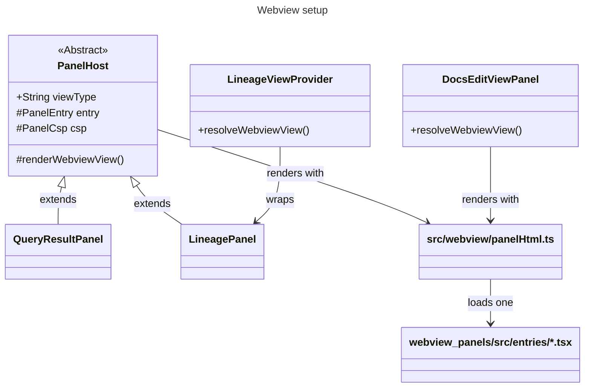

# Webview for extension

## Overview

`LineageViewProvider` is the sidebar `WebviewViewProvider` registered in `package.json`; it delegates rendering and message handling to `LineagePanel`, which is the `PanelHost` subclass. `DocsEditViewPanel` is a standalone provider that renders through the same `panelHtml`.

## Setup notes

### Panel pages

- `panelHtml` in [`../src/webview/panelHtml.ts`](../src/webview/panelHtml.ts) is the only HTML and Content Security Policy generator. It reads the Vite manifest and loads the panel's entry script with a nonce, plus that entry's stylesheets and the codicons.
- Each panel names its `entry` and the `PanelCsp` allowances its page needs; the policy otherwise starts from `default-src 'none'`. The evidence for each directive is in [`../docs/research/webview-csp-october-2026.md`](../docs/research/webview-csp-october-2026.md).

### webview_panels react app

- One Vite entry per panel in [`./src/entries`](./src/entries); each calls [`renderPanel`](./src/renderPanel.tsx) with its root component. The file name is the entry name the host loads.
- Uses [reduxjstoolkit](https://redux-toolkit.js.org/) with useReducer in [AppProvider](./src/modules/app/AppProvider.tsx)
  - This helps us to setup reducers in more readable and maintainable way
- [useListeners](./src/modules/app/useListeners.ts) - common place to listen for incoming messages
  - Component specific message can be listened within component/respective hook
- Assets are stored here [./src/assets](./src/assets)
  - can be accessed via `index.tsx` in the same directory
- `npm run dev` serves `index.html`; `?entry=<name>` selects the panel.

## How to add new panel?

- In `package.json`, add an entry in `viewsContainers -> panel` with expected values
  - add corresponding entry under `views.<container id>`, for example `views.dbt_preview_results`
- Add `src/entries/<name>.tsx` that calls `renderPanel` with the panel's root component, and add `<name>` to `PanelEntry` in `panelHtml.ts`
- Create a provider in a feature folder under [../src/features](../src/features) by extending `PanelHost` with `viewType` same as the one added in package.json above, `entry` set to `<name>`, and the `csp` allowances the page needs
- Add the new provider in [../src/features/panels.ts](../src/features/panels.ts)
- Add the panel to the smoke in `../src/test/smoke/panelSmoke.test.ts`, which fails on any CSP violation

## Guidelines

- UI components are built in [./src/uiCore](./src/uiCore/index.ts) package. Any new UI component should be imported only from this package. This will enable us to apply consistent styling, create ui toolkit and ability to switch to new UI library easily if needed
- `reactstrap` (which is the current ui library) import is restricted in components in `src/modules`, to avoid importing the ui components directly from reactstrap. Instead export the necessary component from [./src/uiCore](./src/uiCore/index.ts) and use it in components
- use `panelLogger` for logging from webview panels. We can make this to use console or any logger in future

## Making API calls

- Webview panel does not make api calls directly. Instead the request will be sent to webview providers and in turn call backend apis
- Each panel imports `executeRequestInSync` and `executeRequestInAsync` from its own `requests.ts`, bound to that panel's `PanelMessage` union in `@fusion-power-user/webview-contract` by [`panelRequests`](./src/modules/app/requestExecutor.ts)
  - `executeRequestInSync` posts a command whose message carries `syncRequestId` and resolves with the host's `response` body
  - `executeRequestInAsync` posts a command without waiting
  - a command outside the union, or a payload that does not match it, is a compile error; ESLint forbids `postMessage` elsewhere
